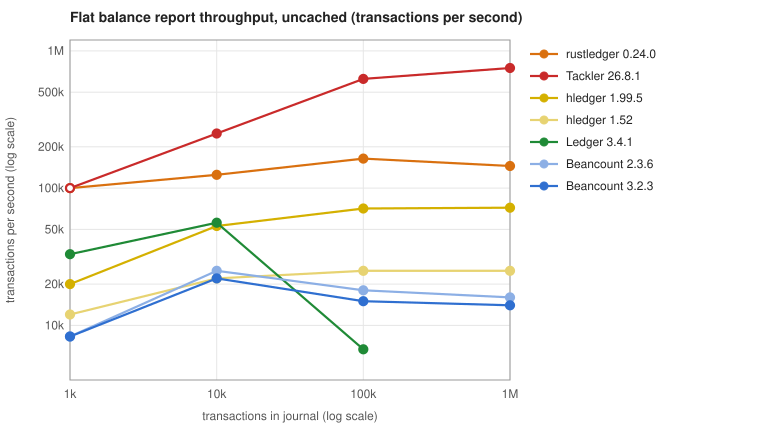
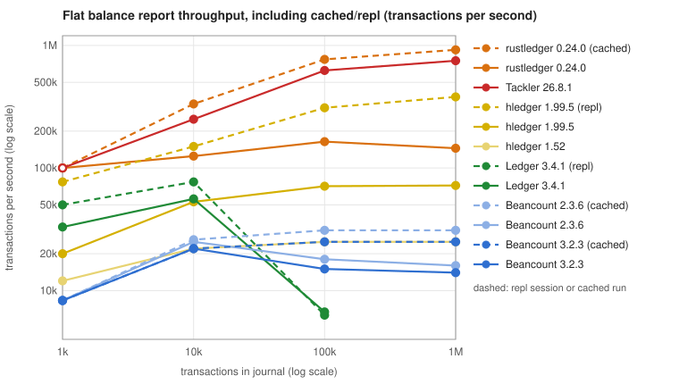
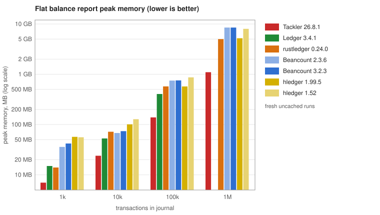

# Performance

How fast hledger is, how that compares with other apps, what makes it slower, and (for developers)
how to measure it and what we have learned about making it faster.

- [How fast is hledger?](#how-fast-is-hledger)
  - [A real journal](#a-real-journal)
  - [Across releases](#across-releases)
  - [Other apps](#other-apps)
- [What makes hledger slower](#what-makes-hledger-slower)
- [For developers](#for-developers)
  - [Measuring](#measuring)
  - [Where the time goes](#where-the-time-goes)
  - [What we have learned](#what-we-have-learned)

## How fast is hledger?

Typical personal finances in many countries might involve 1000-1500 transactions a year.
On a macbook pro m5 pro running hledger's main branch in September 2026
(all numbers use this machine and hledger version unless stated; scale them down or up for your machine/version):

- hledger reports on the current year's data in under a tenth of a second,
  on ten years of data in a quarter second,
  and on twenty years in half a second.

- It processes about 40k messy real-world transactions per second,
  or about 80k simple transactions per second.

- It uses about 2.5 KB of live memory per transaction, 
  which means 5-6 KB of system memory per transaction plus a fixed 30 MB.
  So working with 20 years of data, it uses ~170 MB of system memory.

- For most reports, most of the time is spent reading the data.
  (You can amortise this across multiple commands by using the `run` or `repl` commands.)
  Reports that produce a lot of output (`print`, `register`) spend most of their time rendering.

### A real journal

Reports on a current-year journal are basically instant,
so here are times for a larger 20-year personal journal with 21k transactions in 87 included files,
1990 accounts, 36 commodities, 5k price directives, with comments or tags on many entries,
costs, lots, and balance assertions on 14% of transactions.
Times are seconds, best of three runs (and using -I to work around some old data breakage):

| command  | main | vs hledger 1.52 |
|----------|-----:|----------------:|
| stats    | 0.53 | 2.0x faster     |
| balance  | 0.61 | 1.7x            |
| print    | 0.87 | 1.5x            |
| register | 3.30 | 1.3x            |

With this journal `hledger stats` reports ~42k transactions per second (vs 1.52's ~24k).
It spends 0.45s reading and validating the data, with the parser's fast path handling 85% of transactions;
the rest is 0.06s for the stats report and 0.02s for process startup and shutdown.

### Across releases

hledger's speed has varied over the years.
For comparing versions we use `examples/100ktxns-1kaccts.journal`, generated by `just samplejournals`.
This is a 16 MB journal with 100k transactions, 200k postings, 1k accounts, 26 commodities, 66k cost annotations,
100k P price directives, but no lot annotations, balance assertions/assignments or comments.
Note its entries are simple and regular, so it gains more from recent optimisations than real journals.

Times are seconds for `hledger -f examples/100ktxns-1kaccts.journal COMMAND`, 
best of three runs (`cd bench; quickbench -n3 -w hledger-1.25,hledger-1.52,hledger-1.99.4,hledger`).
All versions are tested in one session, because times vary by a few percent between sessions,
and the older versions' register times by 20% or more.
Transactions per second is the throughput reported by `hledger stats`,
adjusted to compensate for overestimates by 1.52 and 1.99.4:

| command    |  1.25 |  1.52 | 1.99.4 |  main | vs 1.25 | vs 1.52 | vs 1.99.4 |
|------------|------:|------:|-------:|------:|--------:|--------:|----------:|
| stats      |  2.76 |  4.40 |   6.10 |  1.26 |    2.2x |    3.5x |      4.8x |
| balance    |  2.65 |  4.08 |   5.89 |  1.40 |    1.9x |    2.9x |      4.2x |
| print      |  3.33 |  4.61 |   6.55 |  2.09 |    1.6x |    2.2x |      3.1x |
| register   | 63.03 | 17.79 |  21.19 | 14.32 |    4.4x |    1.2x |      1.5x |
| **txns/s** |   36k |   23k |    16k |   80k |    2.2x |    3.5x |      5.0x |

- hledger 1.25 (2022) was one of the fastest 1.x releases
- 1.29-1.32.2 (not shown) have a performance bug with large files, fixed in hledger 1.40
- 1.52 (2026) is the current hledger 1 release
- 1.99.4 is the latest hledger 2 preview
- hledger 2 `main` branch (unreleased) was optimised in 2026-09, and is the fastest-ever hledger.

The balance command is most representative.
With this synthetic journal, hledger main is 4x faster than 1.99.4, 3x faster than 1.52, and 2x faster than 1.25.
It also uses a third less system memory (578 MB, vs 1.52's 868 MB).

Other measurements:\
on a macbook air m1, hledger 1.25 processes about 25k txns/s, and hledger 1.40 about 16k txns/s.

### Other apps

As of September 2026: other plain text accounting apps are tested on the same machine.
(If you're in a hurry, jump to the [charts](#charts) below.)

The test machine is a macbook pro m5 pro with macos 27. The apps are:

- hledger 1.52: `stack install`, built with GHC 9.12.2
- hledger main: `stack install`, built with GHC 9.14.1
- Ledger 3.4.1: `brew install ledger`, an optimised release build
- Beancount 2.3.6: `uv tool install beancount`, Python 3.14.6
- Beancount 3.2.3 with beanquery 0.2.0: `uv pip install` into a virtualenv, Python 3.14.6
- rustledger 0.24.0: `brew install rustledger`
- Tackler 26.8.1: `cargo install tackler --locked`, built with Homebrew's Rust 1.96

The same synthetic journals are used, at different sizes: `examples/1ktxns-1kaccts.journal`, 10k, 100k, 1M.

- Ledger reads these files directly.
- For Beancount and rustledger (a Rust reimplementation of Beancount)
they are converted with `hledger print --export -o FILE.beancount`, which keeps the
price directives.
- For Tackler, I use `hledger print` output with the description quoted, `@@` written as `=`,
and the price directives dropped (Tackler keeps prices in a separate database).

Caching:
- Beancount and rustledger save a cache of the parsed journal
(Beancount only when loading was slow, ie at 100k and 1M here), so they have a "(first run)"
row without it and a "(cached)" row with it.
- hledger's `repl` and `run` commands keep the parsed journal in memory for the session, so later
reports skip reading; the "(repl)" rows show the cost of one more report in such a session, and the session's
peak memory after several reports.
- Ledger's interactive mode (`ledger -f FILE` with no command) works the same way.

Note, the journals have a particular shape (many commodities, accounts, costs, and price directives),
and the apps have different features (they do more or less data inference, validation, calculation etc).
Also, I haven't checked all outputs for correctness. So treat this as a rough sketch.
Please try to reproduce and validate these numbers.

Times are seconds (best of two runs; single runs at 1M) and peak memory (RSS), measured with GNU time;
runs taking more than 5 minutes or 10 GB were killed. 
Results are sorted by small-file performance, fastest at the top.

#### Flat balance report

Commands: `hledger balance`, `ledger balance --flat`, `bean-query FILE 'select account,
sum(position) group by account'`, `rledger report FILE balances`, `tackler --reports balance` with
`type = "flat"` configured. All of these list each account's own exclusive balance.

| app                           |       1k txns |      10k txns |     100k txns |         1M txns |
|-------------------------------|--------------:|--------------:|--------------:|----------------:|
| rustledger 0.24.0 (cached)    | <0.01s, 10 MB |  0.03s, 32 MB | 0.13s, 202 MB |    1.1s, 1.9 GB |
| Tackler 26.8.1                |  <0.01s, 7 MB |  0.04s, 24 MB | 0.16s, 139 MB |    1.3s, 1.1 GB |
| hledger main (repl)           |  0.01s, 58 MB | 0.07s, 118 MB |  0.3s, 661 MB |    2.6s, 6.0 GB |
| rustledger 0.24.0 (first run) |  0.01s, 14 MB |  0.08s, 72 MB | 0.61s, 574 MB |    6.9s, 5.0 GB |
| Ledger 3.4.1 (repl)           |  0.02s, 17 MB |  0.13s, 54 MB |   16s, 406 MB | killed, over 5m |
| Ledger 3.4.1                  |  0.03s, 15 MB |  0.18s, 53 MB |   15s, 405 MB | killed, over 5m |
| hledger main                  |  0.05s, 57 MB | 0.19s, 101 MB |  1.4s, 573 MB |     14s, 5.2 GB |
| hledger 1.52                  |  0.08s, 56 MB | 0.45s, 128 MB |  4.0s, 868 MB |     41s, 8.0 GB |
| Beancount 2.3.6 (cached)      |  0.12s, 36 MB |  0.39s, 68 MB |  3.2s, 533 MB |     33s, 4.8 GB |
| Beancount 3.2.3 (cached)      |  0.12s, 42 MB |  0.46s, 74 MB |  4.0s, 540 MB |     41s, 4.8 GB |
| Beancount 2.3.6 (first run)   |  0.12s, 36 MB |  0.40s, 68 MB |  5.7s, 748 MB |     63s, 8.5 GB |
| Beancount 3.2.3 (first run)   |  0.12s, 42 MB |  0.46s, 74 MB |  6.6s, 756 MB |     72s, 8.5 GB |

#### Print

Commands: `hledger print`, `ledger print`, `bean-query FILE print`, `rledger report FILE journal`,
Tackler's `identity` export.

| app                           |       1k txns |      10k txns |          100k txns |      1M txns |
|-------------------------------|--------------:|--------------:|-------------------:|-------------:|
| Tackler 26.8.1                |  <0.01s, 7 MB |  0.01s, 21 MB |      0.09s, 142 MB | 1.2s, 1.1 GB |
| rustledger 0.24.0 (cached)    | <0.01s, 10 MB |  0.05s, 32 MB |      0.55s, 202 MB | 5.8s, 1.9 GB |
| hledger main (repl)           |  0.01s, 54 MB | 0.08s, 100 MB |      0.8s, 667 MB | 8.0s, 6.1 GB |
| rustledger 0.24.0 (first run) |  0.01s, 14 MB |  0.11s, 81 MB |       1.1s, 574 MB |  12s, 5.0 GB |
| Ledger 3.4.1 (repl)           |  0.02s, 58 MB |  1.7s, 4.0 GB | killed, over 10 GB |      not run |
| hledger main                  |  0.04s, 54 MB |  0.22s, 93 MB |       2.0s, 573 MB |  19s, 5.2 GB |
| Ledger 3.4.1                  |  0.04s, 59 MB |  2.0s, 4.1 GB | killed, over 10 GB |      not run |
| hledger 1.52                  |  0.08s, 54 MB | 0.45s, 129 MB |       4.5s, 849 MB |  44s, 7.9 GB |
| Beancount 2.3.6 (cached)      |  0.11s, 36 MB |  0.43s, 67 MB |       3.8s, 513 MB |  38s, 4.6 GB |
| Beancount 2.3.6 (first run)   |  0.11s, 36 MB |  0.42s, 67 MB |       6.3s, 749 MB |  66s, 8.5 GB |
| Beancount 3.2.3 (first run)   |  0.11s, 42 MB |  0.49s, 73 MB |       7.4s, 756 MB |  83s, 8.5 GB |
| Beancount 3.2.3 (cached)      |  0.13s, 42 MB |  0.49s, 74 MB |       5.2s, 543 MB |  53s, 4.9 GB |

#### Register

Commands: `hledger register`, `ledger register`, `bean-query FILE journal`,
`tackler --reports register`; rustledger has no report with running balances. Note hledger's,
Ledger's and Beancount's show a running total of all postings shown, in all 26 commodities here,
while Tackler's shows a running balance per account in one commodity, which is much less to render.

| app                         |      1k txns |     10k txns |          100k txns |            1M txns |
|-----------------------------|-------------:|-------------:|-------------------:|-------------------:|
| Tackler 26.8.1              | <0.01s, 8 MB | 0.02s, 24 MB |      0.21s, 146 MB |       2.2s, 1.1 GB |
| hledger main (repl)         | 0.13s, 85 MB | 1.1s, 138 MB |        10s, 685 MB |       102s, 6.3 GB |
| hledger main                | 0.15s, 84 MB | 1.1s, 123 MB |     11-14s, 666 MB |       112s, 5.9 GB |
| Ledger 3.4.1 (repl)         | 0.18s, 58 MB | 5.8s, 4.0 GB | killed, over 10 GB |            not run |
| hledger 1.52                | 0.19s, 89 MB | 1.4s, 132 MB |        14s, 852 MB |       144s, 7.9 GB |
| Ledger 3.4.1                | 0.20s, 59 MB | 6.1s, 4.1 GB | killed, over 10 GB |            not run |
| Beancount 2.3.6 (cached)    | 0.28s, 40 MB | 1.5s, 116 MB |        15s, 964 MB |       157s, 9.5 GB |
| Beancount 2.3.6 (first run) | 0.28s, 40 MB | 1.5s, 112 MB |        18s, 1.1 GB | killed, over 10 GB |
| Beancount 3.2.3 (cached)    | 0.28s, 46 MB | 1.9s, 108 MB |        19s, 882 MB |       199s, 8.4 GB |
| Beancount 3.2.3 (first run) | 0.28s, 46 MB | 1.9s, 108 MB |        21s, 1.0 GB | killed, over 10 GB |

#### Throughput

Effective transactions per second, calculated from the balance report table above,
which represents real-world usage best; with first-run and cached figures for the apps that cache;
the 1k figures are rough.

| app                        | 1k txns | 10k txns | 100k txns | 1M txns |
|----------------------------|--------:|---------:|----------:|--------:|
| rustledger 0.24.0 (cached) |   >100k |     333k |      769k |    920k |
| Tackler 26.8.1             |   >100k |     250k |      625k |    750k |
| rustledger 0.24.0 (first run) |    100k |     125k |      164k |    145k |
| hledger main (repl)        |     77k |     150k |      310k |    380k |
| Ledger 3.4.1 (repl)        |     50k |      77k |      6.3k |       - |
| Ledger 3.4.1               |     33k |      56k |      6.7k |       - |
| hledger main               |     20k |      53k |       71k |     72k |
| hledger 1.52               |     12k |      22k |       25k |     25k |
| Beancount 2.3.6 (cached)   |    8.3k |      26k |       31k |     31k |
| Beancount 3.2.3 (cached)   |    8.3k |      22k |       25k |     25k |
| Beancount 2.3.6 (first run) |    8.3k |      25k |       18k |     16k |
| Beancount 3.2.3 (first run) |    8.3k |      22k |       15k |     14k |

#### Charts

*([Remember](#other-apps): the journals have a particular shape (many commodities, accounts, costs, and price directives), and the apps have different features (they do more or less data inference, validation, calculation etc). Also, I haven’t checked all outputs for correctness.)*

<p align="center"></p>

<p align="center"></p>

<p align="center"></p>

#### Commentary

With a typical one-year journal (1k transactions), all of these apps answer in a fraction of a
second, and the differences are hundredths of a second, much of it startup cost: a balance report
takes 0.01s or less with rustledger and Tackler, 0.03s with Ledger, 0.05s with hledger main (0.08s with 1.52),
and about 0.1s with Beancount.
(hledger's, Ledger's and Beancount's `register` reports take 0.15-0.3s even at this size, since
they render a line and a running balance for every posting.)

With large journals (10k to 1M transactions) the apps separate: 

- rustledger and Tackler are fastest. rustledger's first run is 2-2.5x faster than hledger main at
100k and 1M (with the same memory), and its cached runs 10-13x faster (2-2.5x faster than a
repeated report in hledger's repl). Tackler, with no cache, is 2-5x faster than rustledger's first
runs and close behind its cached runs on the balance report (0.16s vs 0.13s at 100k), ahead of them
on print, and uses the least memory of all the apps.
- Tackler's default balance report is a tree which also shows each account's subtree total; that
calculation grows superlinearly with the number of account and commodity pairs (1.1s at 10k, 
1.5s at 100k, 2.7s at 1M, against 0.04s, 0.16s and 1.3s for the flat report shown). So here we
configure all apps to give a flat report (hledger, Beancount and rustledger do this by default).
- Beancount 2 and 3 are 2x slower than hledger main at 10k and 3-5x slower at 100k and 1M on a first
run (3 is no faster than 2 here), though their cache makes repeated runs faster. Their register
(`bean-query journal`) renders the same kind of running total as hledger's and costs 1.3-1.8x more
- Ledger grows superlinearly on these journals, in time (balance: 0.18s at 10k, 15s at 100k; its
default tree balance report takes 18s) and memory (print and register need 4 GB at 10k and over
10 GB at 100k, in its interactive mode too). Up to 100k the cost is in its reports rather than its
reading, which takes 0.5s at 100k (`ledger source`): with the journal already loaded in its
interactive mode, a 100k balance report still takes 16s. At 1M its reading is slow as well: reading
alone had not finished after 15 minutes, and the balance report was killed after 5m, in interactive
mode too, so the other 1M reports were not run.

At 1M transactions memory becomes the constraint: hledger 1.52 and Beancount need 8-8.5 GB (and
Beancount's register over 10 GB on a first run), hledger main and rustledger's first run 5 GB,
rustledger's cached run 1.9 GB, and Tackler 1.1 GB.

Checking a journal (`hledger check`, `ledger source`, `bean-check`, `rledger check`, `tackler` with
no reports or exports configured) takes at 100k txns: hledger 1.52 3.6s, hledger main 1.1s, Ledger
0.54s, Beancount 2 and 3 4.6-5.2s (0.8s cached), rustledger 0.6s (0.1s cached), Tackler 0.08s.

#### Summary

- hledger 1, Beancount 2, Beancount 3 are similar in speed
- hledger main is faster
- Ledger 3.4.1 is faster still with small files, but scales badly with large files
- Ledger's repl gives a 1.5x speedup with small files, doesn't help with large files
- hledger's repl gives a 3-5x speedup at all sizes
- rustledger and Tackler are much faster than the rest.
- Tackler uses less memory than rustledger, and shows a flat balance report almost as fast as it.
  (When configured right. Its default tree balance report is slow with large files.)
- Tackler does print and register reports faster than the rest. (Its register works differently.)
- Who is the current speed king ? Tackler wins for output speed and low memory usage.
  rustledger barely wins for balance reports (the most used real-world report),
  and therefore wins on throughput also. But only on cached runs. Tackler doesn't use a cache.

<!-- When a release is made, update these tables (and the "main" wording above),
then update the figures in tools/perfcharts.py and run it to regenerate the charts. -->
<!--
- [Tackler](https://tackler.fi/docs/tackler/latest/features/performance/) "can process from 300 000 to 900 000 transactions per second on modern laptop"
- [rustledger](https://rustledger.github.io/roadmap/performance.html) "10-30x faster than Python Beancount on typical ledgers"
-->

## What makes hledger slower

Back to hledger: Run time grows with the number of postings, with how much each entry uses beyond the basics, and
with how much output a report produces.

**Size.** Time is roughly proportional to the number of transactions and postings: about 40k
real-world transactions per second, 80k simple ones. A 10k-transaction journal takes about 0.2s
for a balance report, 100k about 1.4s, 1M about 14s (simple entries). Memory is proportional too:
about 2.5 KB of peak live data per transaction, and 5-6 KB of process memory per
transaction plus a fixed 30 MB: 100k transactions need about 0.6 GB and a million about 6 GB
(or a third less with `+RTS -c -RTS`, see Memory options below).

**Entry shape.** Parsing is about half of a run. Entries with dates, status marks, a code, a
description, comments and tags, account names and amounts (optionally with a cost) take a fast
path in the parser and parse about a third faster than others. Entries with balance assertions,
lot annotations, quoted commodity symbols, exponents, or bracketed dates in posting comments use
the general parser (`--debug=1` reports how many, and why). Long descriptions and account names,
and numbers with digit group marks, cost little extra.

**Directives.** Price (P) directives each cost about as much as a simple transaction to parse, so a
large price history adds up (100k of them: about 0.2s). Commodity and account directives are
cheap. Any balance assertion or assignment makes the transaction balancer do a second pass over the
journal (about 8% more time on a 100k journal, the same whether one posting or every posting is
asserted); each further ordinary assertion costs little, but inclusive assertions (`=*`) each scan
every account's balance, so thousands of them on a journal with many accounts are slow. `-I` skips
the checking pass, but not the parsing. Auto posting rules, periodic transaction rules (with
--forecast), and lot tracking each add processing stages; a journal using lots pays for lot
processing on every command, even ones that don't show lots (about 0.4s per 1000 lot transactions
on top of a 100k journal).

**Accounts.** The number of accounts matters less than the number of postings. Thousands of
accounts add a little to journal finalising and to balance reports, which have more rows to build
and show. Deep account names cost little.

**Commodities.** Reports that render running balances or totals in many commodities are much
slower, because each row shows every commodity: `register` on the 100k-transaction journal with 26
commodities takes 14s, of which about 10s is rendering, while `balance` on it takes 1.4s.
Most real journals have few commodities and don't see this. Valuation (`-V`, `-X`, `--value`)
adds price lookups per amount, more with a large price history.

**Reports.** After reading, `stats` and `balance` are cheap. `print` spends about 0.9s per 100k
transactions rendering. `register` is dominated by its output, so limiting it (a query, a period,
`--depth`, or `-w`) helps directly. Reports over many periods or with many rows cost more to build.
`hledger-ui` and `hledger-web` keep the journal loaded, so they pay the reading cost once and then
per report.

**Files.** Including many files is fine (87 files, 21k transactions: 0.45s); the per-file cost is
small. hledger reads everything it is given, so keeping old years in separate files and reading
only what a report needs (`-f`) reduces work proportionally. CSV and other formats add their
conversion cost on top.

**Startup.** Each run spends about 2.5 ms in hledger's own startup (option processing) and about
20 ms more launching and shutting down the process, so a small journal's `balance` takes about
30 ms however small it is; a script calling hledger hundreds of times pays that each time.

**Memory options.** To cap memory use, run with `+RTS -M2G -RTS` (or another limit); hledger
stops with an error if it needs more. To use about 20-40% less memory on large journals, at the
cost of running 40-60% slower, add `+RTS -c -RTS` (the compacting garbage collector). See
`+RTS -s -RTS` for memory and garbage collection statistics.

## For developers

### Measuring

#### quickbench

[quickbench](https://github.com/simonmichael/quickbench) times the commands listed in a file
(`just bench` uses `bench/bench.sh` by default) and shows a table of results,
optionally running each command with several different executables, side by side.
Install it as described in [DEVWORKFLOWS](DEVWORKFLOWS.md#get-developer-tools), then:

```cli
$ just bench                    # time the commands in bench/bench.sh, with the hledger in PATH
$ just bench -f bench/bench10k.sh -w hledger-1.30,hledger-1.31,hledger-1.32 -n2 -N2   # compare versions, best of 2 runs, twice
```

The other `bench*.sh` files in the bench/ directory are alternative command sets,
eg for many accounts, many transactions, or comparing with Ledger.
quickbench needs the executables to be in PATH.

#### Throughput with stats

`hledger stats` reports transactions per second. These recipes use it to show throughput at various data sizes:

```cli
$ just bench-throughput EXE      # with the given hledger executable
$ just bench-throughput-dev      # with the current dev build
$ just bench-throughput-recent   # with recent installed hledger versions
```

The elapsed time behind that figure starts early in `main`, so it includes hledger's own startup
(about 2.5 ms, mostly option processing; it was about 15 ms with a 60-directory PATH, until the
scan for add-on commands was made conditional) but not the process launch and exit (about 20 ms
more, invisible from inside the process). So it understates throughput on small journals: on the
1k-transaction sample journal it reports 60k transactions per second where the per-transaction rate
is 71k, at 10k 86k against 88k, and at 100k the difference is negligible. Compare sizes above 10k,
or subtract the fixed cost.

#### Performance test

`just perftest` runs [hledger/test/_perf.test](https://github.com/hledgerorg/hledger/blob/main/hledger/test/_perf.test),
which logs `hledger stats` throughput to `perf.log` (kept locally, for spotting changes over time),
tagging each line with the machine's CPU model, and fails if throughput is below a threshold.

#### Phase timings

Running any hledger command with `--debug=1` (or higher) reports on stderr the run time and
memory allocation of each phase: reading and parsing the data, each stage of journal finalising,
and the command itself (see `dbgTime` in Hledger.Utils.Debug). Each stage's result is fully
evaluated to measure it (and the cost of that evaluation is excluded), so this describes a strict
evaluation of the pipeline, but the totals closely match normal runs. One consequence: work that
a normal run leaves unevaluated is charged too, eg inferred market prices, which only valuation
uses, appear as a cost of every command. Garbage collection pauses are charged to whichever
stage is running. This is the best tool for judging an optimisation.
After parsing each file, it also reports what share of the transactions and price directives
the journal parser's fast path handled, and why it declined the others (see Parsing, below),
which shows what keeps a particular journal off the fast path. (Transactions from CSV,
timeclock or timedot files are not parsed by it, so they are not counted.)

#### Profiling

`just hledgerprof` builds a profiling-enabled `bin/hledgerprof`, then `just quickprof CMD`
runs a hledger command on a sample journal and shows the profile (using profiterole).
See `just h prof` for related recipes.
With GHC 9.14, `stack --profile` fails (a compiler panic while building tls); instead build with
[stack-prof.yaml](https://github.com/hledgerorg/hledger/blob/main/stack-prof.yaml), which works
around that and keeps its own `.stack-prof` work dir, as described in its header.

Use profiles to find candidates, and phase timings or quickbench to judge them.
Profiling inflates small hot functions (source position calculation looked like 8% of the run, but
removing it saved 4%) and shifts the shares of the rest.
With megaparsec's continuation-passing parsers, the cost shown beneath a parser in the profile tree
mostly belongs to its continuation (everything parsed after it), so read the individual columns,
or measure directly.

#### Package benchmark

[hledger/bench/bench.hs](https://github.com/hledgerorg/hledger/blob/main/hledger/bench/bench.hs)
is the hledger package's benchmark suite: it calls the library directly, timing a journal read and the
print, register and balance reports (quick timings by default, or criterion measurements with `--criterion`).
It is currently disabled (`buildable: false` in hledger/package.yaml) to save build time,
so `stack bench hledger` does nothing; to use it, enable it there.

#### Tips

- Allocation is the most reliable signal: it is deterministic, and it tracks garbage collection cost.
  Wall clock time varies by a few percent between runs on a typical machine, and more between
  sessions, so rerun before believing a small change, and measure versions being compared in one session.
- Check conclusions from the synthetic journals on a real journal too: real ones have more comments,
  tags and multi-line transactions, few commodities, and many files.
- To measure one kind of journal line, split the journal by line kind; eg a copy without price
  directives (`grep -v '^P '`) and one with only them showed the price directives costing a quarter
  of the parse time.
- To see what memory is made of, make a heap census with source locations: build with
  `--ghc-options='-finfo-table-map -fdistinct-constructor-tables'` in a scratch work dir, run with
  `+RTS -hi -l -RTS`, and map the census's addresses to source locations with
  `ghc-events show hledger.eventlog` (its "Info Table" lines). A profiling build's census (`-hc`, `-hd`)
  is less accurate here: profiling disables optimisations, so it shows unevaluated closures which
  normal builds don't have.
- Judge memory by `+RTS -s`'s maximum residency and bytes copied, not by a census's highest sample.
  A census forces a major collection at every sample, so it catches short-lived peaks which the ten
  or so major collections of a normal run never see; its plateaus are more representative.
  `+RTS -s` itself may report up to 240 MB maximum residency and 530 MB in use for the 100k
  `balance` whose live data is about 150 MB, depending on where its few major collections happen
  to land.
- Don't combine a census with `--debug=1`, whose phase timing fully evaluates each stage and so
  changes what is in memory.
- `HLEDGER_FASTPATH=off` runs the general parser only, to measure it; `HLEDGER_FASTPATH=check`
  verifies the fast path (see Parsing, below).
- `hledger +RTS -s -RTS` shows the runtime system's memory and GC statistics.
  hledger accepts other runtime flags too, so GC settings (`-A`, `-F`, `-xn`, `-c`) and memory
  limits (`-M`) can be tried directly, and `+RTS -hT -RTS` makes a basic heap profile without a
  profiling build.

### Where the time goes

The real journal above, `hledger stats -I --debug=1`, September 2026 (0.49s under the timer;
0.53s in a normal run):

| phase                                     | time  | allocation | notes                                              |
|-------------------------------------------|-------|------------|----------------------------------------------------|
| parse (87 files)                          | 0.23s | 1.1 GB     | 47%; 85% of transactions on the fast path          |
| journalAddAccountTypes                    | 0.03s | 44 MB      | 1990 accounts                                      |
| journalStyleAmounts                       | 0.02s | 56 MB      |                                                    |
| journalPostingsAddAccountTags             | 0.02s | 32 MB      |                                                    |
| lot stages (basis, transacted cost, gain) | 0.05s | 109 MB     | the journal uses lots                              |
| journalBalanceTransactionsAndDeferAssertions | 0.07s | 298 MB  | assertion checks skipped by -I                     |
| other finalising stages                   | 0.03s | 90 MB      |                                                    |
| stats command                             | 0.04s | 31 MB      |                                                    |

And the synthetic journal, `hledger balance -f examples/100ktxns-1kaccts.journal --debug=1`, about
1.4s in total (1.35s in a normal run):

| phase                                        | time  | allocation | notes                                                           |
|----------------------------------------------|-------|------------|-----------------------------------------------------------------|
| startup + read                               | 0.05s | 68 MB      |                                                                 |
| parse                                        | 0.67s | 2.7 GB     | 47% of the run; the fast path handles every entry here          |
| journalStyleAmounts                          | 0.08s | 218 MB     | rebuilds every posting to set display styles                    |
| journalBalanceTransactionsAndDeferAssertions | 0.20s | 415 MB     | the second pass is skipped; includes a GC pause landing here    |
| journalInferMarketPricesFromTransactions     | 0.07s | 348 MB     | only charged under the timer; only valuation uses these         |
| other finalising stages                      | 0.11s | 243 MB     | reverse, account types, cost tagging, style inference           |
| balance command                              | 0.24s | 1.0 GB     | building the account tree, rendering                            |
| garbage collection, spread over all of these | 0.47s |            | 4.6 GB allocated; about 150 MB of live data                     |

Register is much slower on this journal (14s) because it renders a running balance in 26
commodities for 200k lines; real journals have few commodities.

### What we have learned

The September 2026 speedups (listed by `git log --grep='^perf:'`) came mostly from:
skipping lot processing for journals which don't use lots;
dispatching each journal item on its first character, and checking the next character before
trying optional syntax, instead of trying parsers and backtracking;
inferring commodity styles in one pass;
avoiding needless work in the transaction balancer;
multiplying decimal numbers directly;
not rebuilding the journal for empty queries;
using megaparsec 9.8.3, which fixes a slowdown in megaparsec 9.3 to 9.8.2
([megaparsec#612](https://github.com/mrkkrp/megaparsec/issues/612));
using less memory, which also means less garbage collection: the parser no longer leaves
unevaluated work piling up as it builds the journal, and parsed amounts share their display styles,
account names and commodity symbols instead of each having its own copy;
parsing cost and lot annotations by looking at the next character instead of with a permutation parser;
a fast path which parses the commonest shapes of transaction and price directive by scanning
the text directly, avoiding megaparsec's per-token overhead;
and scanning PATH for add-on commands only when the command is not a builtin one.
The details:

#### Parsing

- A failed parse attempt is expensive: megaparsec builds an error value, with sets of expected
  items and hints, for every failure, even one immediately backtracked by `try` or `optional`.
  A typical transaction and price directive used to fail dozens of attempts, and each one-line price
  directive allocated 47 KB. So optional syntax (signs, commodity symbols, exponents, costs, lot
  annotations, comments, status marks, codes, secondary dates, balance assertions, times in price
  directives) is checked by peeking at the next character or two, with Hledger.Utils.Parse's
  `peekChar`, `peekChars2` and `peekAfterSpaces`, and parsed only when present; `manyWhile` ends
  loops the same way. Journal items are dispatched on their first character, rather than trying
  each directive parser in turn. When adding syntax, keep to this pattern.
- Labels (`<?>`) cost nothing measurable.
- Most of what remained in the parser was megaparsec's own machinery: a plain scan of the 100k
  journal that decodes every amount takes 0.04s, one that also builds Decimal-carrying records
  for everything 0.18s, against about 0.9s for the megaparsec parser, and a minimal transaction
  still cost 65% of a full one. So the journal reader now has a fast path (fasttransactionp,
  fastmarketpricedirectivep in JournalReader.hs): before running the general transaction or
  price directive parser, it scans the text directly for the commonest shapes of entry (a date,
  optionally a secondary date, status mark and code, a description and a comment with tags;
  postings with an optional status mark, an account name, a simple amount, optionally with a
  cost, and a comment with tags and date tags; price directives, optionally with a time of day)
  and builds the same result, declining to the general parser for
  anything else, including anything that would be an error, so results and error messages are
  unchanged. It reuses the general parser's number interpretation, so declared styles and
  decimal marks behave the same. This took the parse from 0.92s to 0.63s and halved allocation.
  `HLEDGER_FASTPATH=off` disables it (for comparisons), and `HLEDGER_FASTPATH=check` parses each
  fast-path entry with the general parser too and fails on any difference; the functional test
  suite passes in check mode, and hledger/test/journal/fastpath.test exercises the accepted
  subset that way. `--debug=1` reports its hit rate and the reasons for declines, which shows
  what extending it to more syntax would gain on a given journal. When adding journal syntax,
  either the fast path's guards must exclude it, or the fast path must handle it identically
  (and the check mode should be run).
- Keep the fast path cheap for the commonest shapes: when it learned comments, it split off each
  next line to see whether it was a comment line, and then split it again as a posting, and plain
  transactions parsed 2% slower and allocated 6% more. Checking the line's first characters
  instead, and making the line scanner's results strict (they were thunks, though every caller
  forced them), recovered that. Refreshing the release table is what caught it: compare allocation
  after every change, even one that adds nothing to the common path.
- Costs and lot annotations after an amount were parsed with a permutation parser; its failed
  attempts at the other alternatives made a cost cost three times as much as a whole posting.
  Dispatching on the next character or two instead was 12% off the parse.
- Megaparsec 9.3.0 and later made hledger's parser about 15% slower and 33% more allocating
  (the plain Text Stream instance now delegates through a newtype),
  reported as [megaparsec#612](https://github.com/mrkkrp/megaparsec/issues/612) and fixed in
  megaparsec 9.8.3 by INLINE pragmas on those instances, which made all commands about 10% faster.
  hledger's stack configs use 9.8.3; its package bounds still allow older versions, which work
  correctly, only more slowly.
- Postings are built strictly while parsing, which lowers peak memory; fully forcing them with
  deepseq was slower, because it evaluates tags and comments that most reports never read.
- The parser accumulates the journal in its state, and each update must be strict, down to the list
  being added to: `j{jtxns = t : jtxns j}` left an unevaluated list update per transaction, which
  piled up through the whole parse. Making these strict cut garbage collection copying by a quarter.
  Likewise, strict fields only evaluate to the outermost constructor: a `!(Maybe Char)` field
  can still hold an unevaluated Char, keeping parser data alive.
- Balance assertions: the first one in a journal makes the balancer do its second pass over all
  postings (0.14s and 316 MB at 100k, about 0.7µs and 1.6 KB per posting); each further ordinary
  assertion costs under 1µs to check but about 3µs to parse (asserted postings take the general
  parser); inclusive assertions (`=*`) fold over all accounts per check (20k of them on a
  10k-transaction, 1000-account journal: 0.36s, 13x the ordinary kind). Extending the fast path to
  assertions is a remaining idea (see NOTE-performance).

#### Finalising

- The lot stages run for any journal with lot features, even for reports that don't mention lots,
  because they add gain postings and cost basis amounts that ordinary reports show
  (`-I` is the way to skip them). So lot work is skipped per transaction, for transactions without
  lot-related amounts, rather than per command.
- Commodity style inference can't be done just once: forecast transactions, auto postings and
  balancing add amounts later.
- Applying display styles at report time instead of storing them on each amount was considered and
  rejected: every report would need to get it right.
- Decimal's `(*)` goes via Rational and 10^255 (about 6 KB and over a microsecond per
  multiplication), so amounts are multiplied with `multiplyQuantities` instead. Decimal's `(/)`
  has the same problem, but is used only on rare paths.
- Journal filtering with an empty query used to rebuild every transaction; it now returns the journal
  unchanged. Other report paths that filter with possibly-empty queries may have similar no-op passes.

#### Startup

- Every run scanned PATH for `hledger-*` add-on commands before doing anything else: with 60
  directories holding 8000 files that was 11 ms and 22 MB, most of hledger's startup, spent in the
  directory listing itself (sorting the names cost nothing measurable). Now the scan happens only
  when the command is not a builtin one (or is `run`/`repl`, which run add-ons), so startup is
  about 2.5 ms. Of a small run's remaining 20 ms, about 10 ms is the loader and RTS init before
  `main`, and 6-8 ms the RTS shutdown after the output; neither is visible from inside the program.

#### Memory and garbage collection

- Garbage collection time is mostly the copying of the live journal, not collection overhead:
  nursery sizes from 4 MB (the default) to 128 MB made no difference except to memory use.
- The in-memory journal now takes about 1.5 KB per transaction (152 MB for the 100k journal),
  down from 2.6 KB. Most of the saving came from sharing: journals use few distinct amount styles,
  account names and commodity symbols, so the parser keeps the ones it has seen
  (`jparseamountstyles`, `jparsetexts`) and gives identical ones the same object, and the styling
  pass does the same for amounts whose precision differs from their commodity's.
  Less live data means less garbage collection: this made reading about 10% faster overall.
- Tried without effect: re-pointing postings to their transformed transaction during posting
  transforms, and stopping the balancer from holding on to its input journal. Both addressed
  short-lived peaks, not the steady state.
- Some runtime flags trade memory for time: `-xn` (the non-moving collector) saved 10% of the run
  time but raised peak memory from 0.8 to 1.3 GB; `-xn -F3` saved 13% for 24% more; `-F4` 6% for 32%
  more. Not adopted as defaults.
- The compacting collector (`+RTS -c`) trades the other way. It compacts live data in place instead
  of copying it, so the runtime needs about twice the live data instead of nearly three times, but
  garbage collection takes 2.5-3 times as long. On the 100k journal: 382 instead of 491 MB peak RSS
  (-22%), 2.30 instead of 1.65s (+40%). On the 1M journal: 3.2 instead of 5.4 GB (-41%), 25.6 instead
  of 15.7s (+63%). A `-M` cap enables compaction automatically as the heap nears it: the 1M journal
  finished with `-M3g` in 3.3 GB and 24.6s, and failed with `-M2500m` after 43s. Recommended in the
  manual for users short of memory, not as a default.
- Compiling with `-fexpose-all-unfoldings -fspecialise-aggressively` gave only 4%, for a much longer
  build. Not adopted.

#### Reports

- The balance report's own cost is mostly building the account tree (a HashMap update and period
  data insertion per posting); rendering computes each amount's width more than once.
- Register's cost is mostly output volume (rendering running balances).
